# entitysa_nlp 🗣️😕😏
entitysa_nlp : Natutal Lasnguage API # Entity &amp; Sentiment Analysis # NLP

## Objective

- Create Natural Language API request and calling the API with curl
- Extract entities & running sentiment analysis on text with the Natural Language API
- Perform linguistic analysis on text with the Natural Language API
- Create Natural Language API request in a different language (Japanese)

## Entity & Sentiment Analysis with Natural Language API 

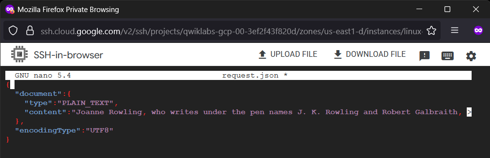

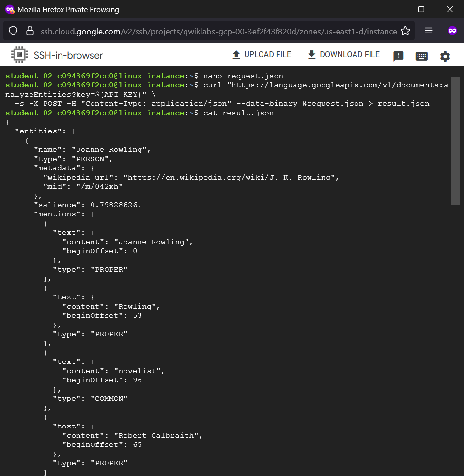

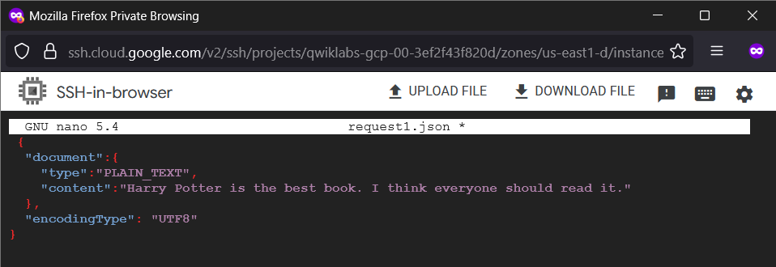

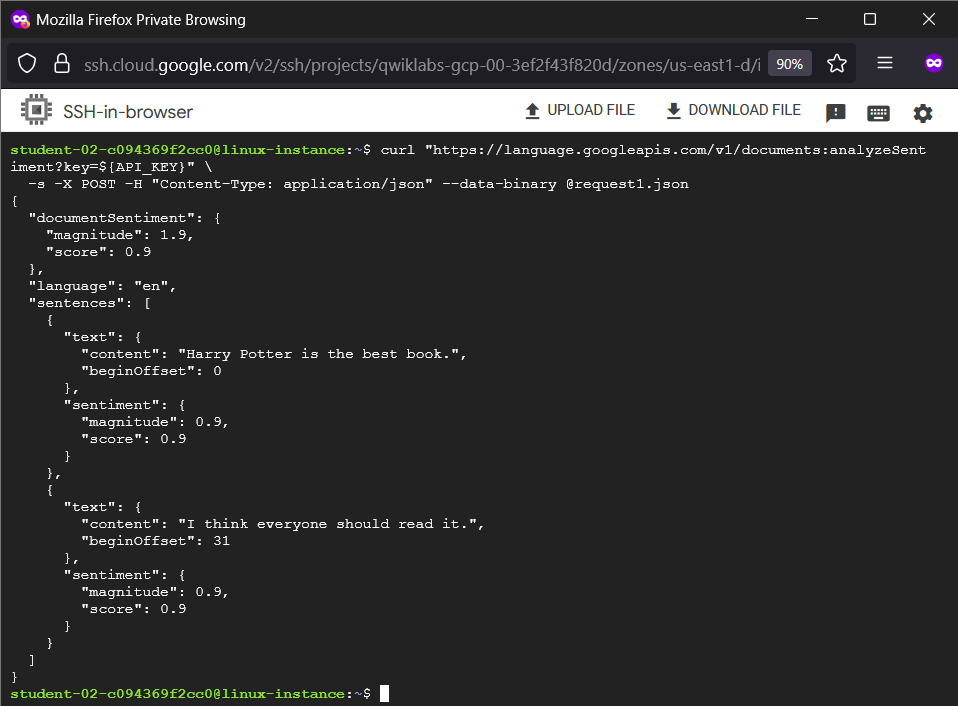

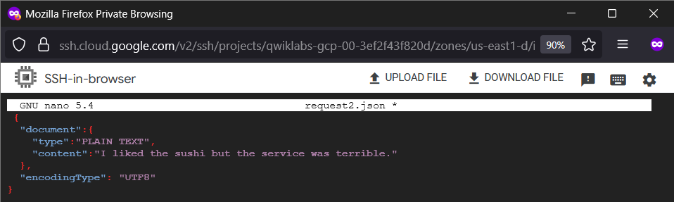

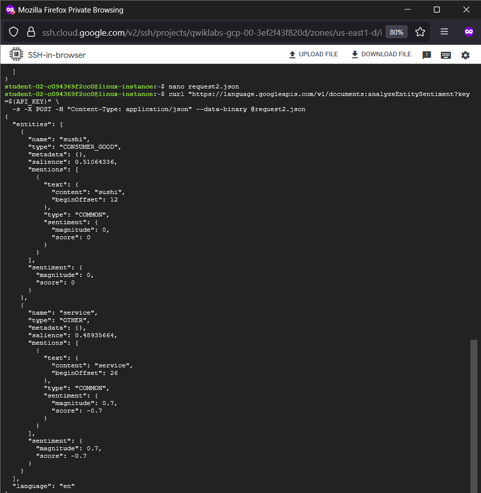

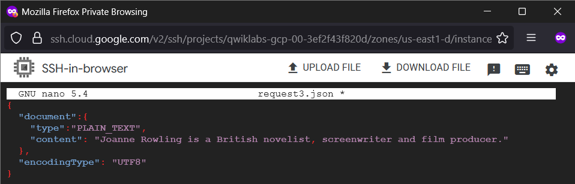

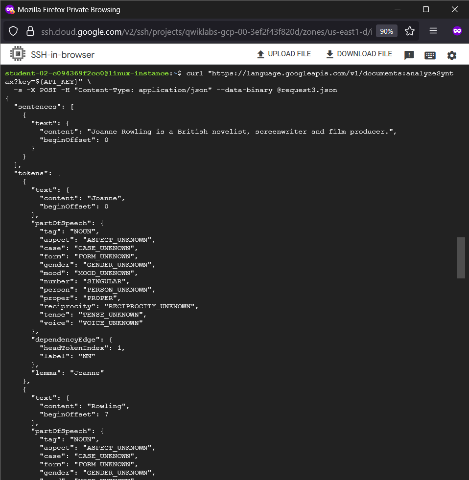

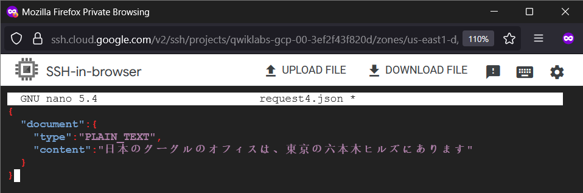

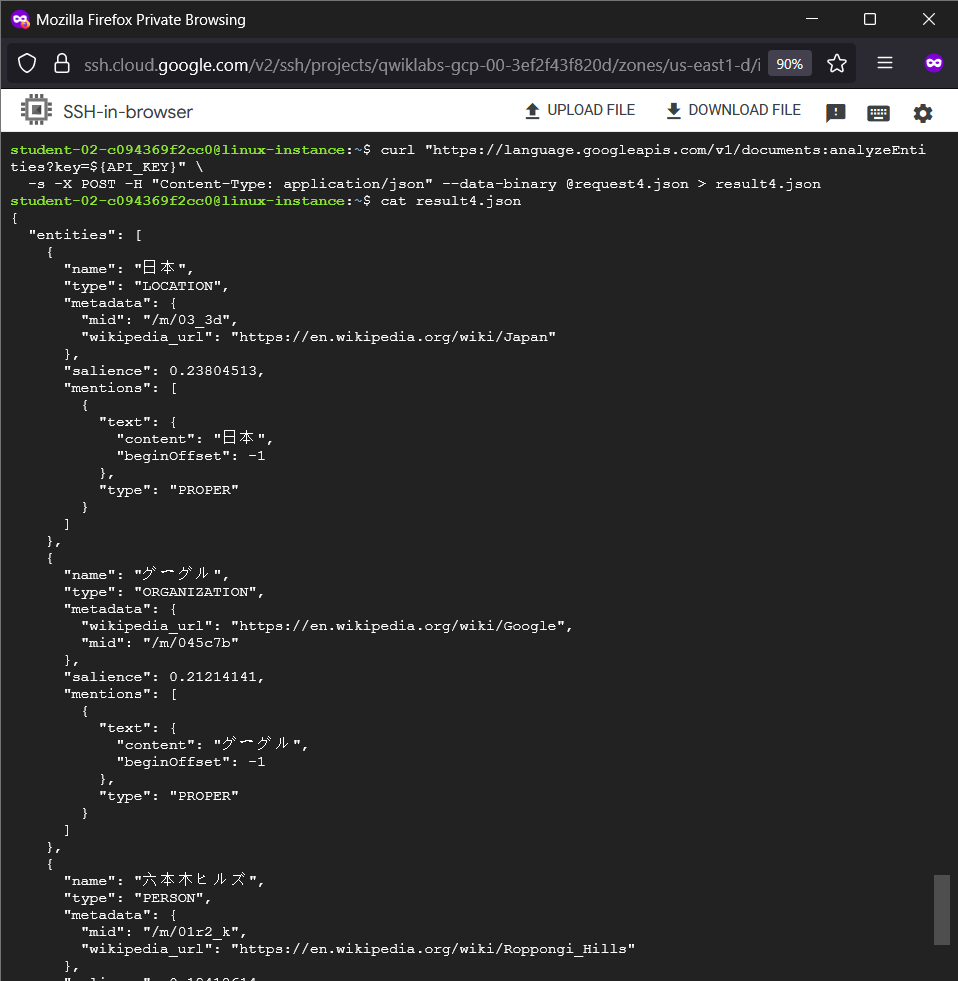

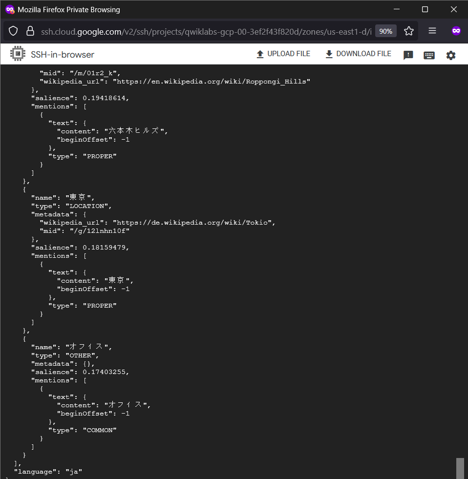
